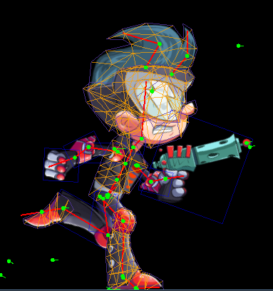
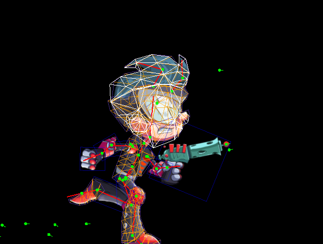
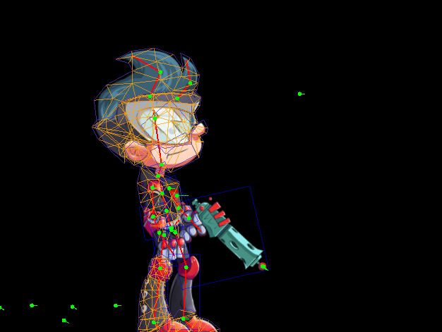

# Mesh Physics for Skeletal Character

## Example Explaining

**Basic mesh physics:**
`com.esotericsoftware.spine.PbdTest0`
Showcase of basic mesh physics with gravity and collision to the ground.

**Mesh physics constrained by lbs**:
`com.esotericsoftware.spine.PbdTest1`
Add linear blend skinning as constraints to mesh physics

**Animatin complementary**:
`com.esotericsoftware.spine.PbdApplication`: 
Select some free bones and let physics complement their animation.

`com.esotericsoftware.spine.PbdApplication_SpineBoy`: 
Spine-boy with hair animation complemented by physics.

## Data Explaining

### Mesh Data

**Rigged mesh**: For a skeletal character, we define a rigged mesh, or so called skin, as $\hat{\mathbf{x}}$. This is the common mesh we see that is controlled by linear blend skinning (LBS).

```
com.esotericsoftware.spine.pbd.LbsData.rigVerts
```


<figcaption>Fig.1 - Rigged mesh.</figcaption>
<br>

**Sim mesh**: We cannot apply physics to the rigged mesh, because it's fully controlled by LBS. We define a sim mesh $\mathbf{x}$. It will be updated by physics simulation.

```
com.esotericsoftware.spine.pbd.DeformMesh.vertices
```


<figcaption>Fig.2 - Sim mesh. (white)</figcaption>
<br>

**Ref mesh**: Physics simulation needs a reference, and this reference is the setup pose of the character. We assume that the reference mesh $\overline{\mathbf{x}}$ represents the static status with no internal force.

```
com.esotericsoftware.spine.pbd.DeformMesh.refVertices
```


<figcaption>Fig.3 - Ref mesh.</figcaption>
<br>

In all computation related to physics, the positions are **rescaled** by `pbd.MeshData.scale`:
```
scale = 1.0 / max(max_x - min_x, max_y - min_y)
```
This is important because we do not need to adjust other physics parameter, no matter how big or small the input mesh is.

Other mesh data:
- `pbd.DeformMesh.indices`: Flatten indices of triangles. For example, [0, 1, 2]
- `pbd.DeformMesh.faceMass`: Mass of each triangle
- `pbd.DeformMesh.vertMass`: Mass of each vertex

## LBS Data

Data related to lbs:
- `pbd.LbsData.BoneMatsRef`: The affine transformation matrix of each bone in setup pose
- `pbd.LbsData.BonePosRef`: The translation of each bone in setup pose

**Compressed weights**:

Here is an example that stores particles in cells in compressed format:


Replace cells with bones, `pbd.LbsData.weights` store vertices related to each bone in similar format.

## Method Explaining

### Linear Blend Skinning

Each bone $j$ contains an affine transformation $\mathbf{A}_j$ and translation $\mathbf{t}_j$. Similarly, we use $\overline{\mathbf{A}}_j$ and $\overline{\mathbf{t}}_j$ to denote the transformation and translation in setup reference pose.

LBS can be represented as

```math
\hat{\mathbf{x}}_i=\sum_j w_{ij}(\mathbf{A}_j^*(\overline{\mathbf{x}}_i - \overline{\mathbf{t}}_j) +\mathbf{t}_j)
```

where $w_{ij}$ is the binding weights, and $`\mathbf{A}_j^*=\mathbf{A}_j \overline{\mathbf{A}}_j^{(-1)}`$ is a relative affine transformation. In reference pose, we have $`\mathbf{A}_j^*=\mathbf{I}`$ (identity matrix).

`pbd.LbsData.inverseMixed`: Suppose we know $\mathbf{x}$ and current bone translation $\mathbf{t}_j$. We want to find the best fit affine transformation $\mathbf{A}_j$ to minimize the loss function

```math
\sum_i ||\mathbf{x}_i - \hat{\mathbf{x}}_i||.
```

By differentiating the loss function wrp. $\mathbf{A}^*_{j}$, we have

```math
\begin{align*}
  \mathbf{P} &= \sum_i  (\mathbf{x}_i-\mathbf{t}_j)(\overline{\mathbf{x}}_i-\overline{\mathbf{t}}_j)^T\\
  \mathbf{Q} &= \sum_i  (\overline{\mathbf{x}}_i-\overline{\mathbf{t}}_j)(\overline{\mathbf{x}}_i-\overline{\mathbf{t}}_j)^T\\
  \mathbf{A}^*_{j} &= \mathbf{P}\mathbf{Q}^{-1}
\end{align*}
```

And get $\mathbf{A}_j = \mathbf{A}^*_j \overline{\mathbf{A}}_j$.

If we want to enforce only rotation instead of affine transformation, we can simply use polar decomposition to extract the rotation part of $\mathbf{A}^*_j$.


### Position-Based Dynamics
PBD is the real-time simulation technique from Nvidia. It is fast enough for real-time application, visually appealing and stable. The creator of this method provides [tutorials](https://matthias-research.github.io/pages/tenMinutePhysics/index.html) for web physics.

#### Workflow

Briefly explaining, we start with the positions in current time step $\mathbf{x}^{k}$, and velocity in current time step $\mathbf{v}^{k}$. We want the status of the next time step after time $dt$. The external force $\mathbf{f}_{ext}$ is assumed to be constant on all vertices, such as gravity.

The workflow is very simple:

1. [Generate prediction](https://github.com/yoharol/PBD_Taichi/blob/3b4d3f8f69efcbff7b4b8e516d08417bfde65a55/cons/framework.py#L25C1-L31C80): $`\mathbf{p}_i = \mathbf{x}^k_i + \mathbf{v}_i^k dt + \mathbf{f}_{ext}dt^2`$ 
2. Constraints projection: Iterate through all constraints $C$, project the constraints to modify $\mathbf{p}_i$
3. [Update velocity](https://github.com/yoharol/PBD_Taichi/blob/3b4d3f8f69efcbff7b4b8e516d08417bfde65a55/cons/framework.py#L33C1-L38C68): Finish this time step, update velocity $`\mathbf{v}_i^{k+1} = e^{-\beta dt}\frac{\mathbf{p}_i - \mathbf{x}^k_i}{dt}`$.
   
$\beta$ is a damping parameter. $`\beta=0`$ means no damping.

The [python code](https://github.com/yoharol/PBD_Taichi/blob/3b4d3f8f69efcbff7b4b8e516d08417bfde65a55/test/fish_deform.py#L67C1-L71C22) is

```python
    xpbd.make_prediction()
    xpbd.preupdate_cons()
    for _ in range(sovle_step):
      xpbd.update_cons()
    xpbd.update_vel()
```

#### Constraints Projection

All the physics in PBD is represented by a set of scalar functions $C_j$. For example, if two vertices $\mathbf{p}_1$ and $\mathbf{p}_2$ is connected by a mass spring with rest length $l_{12}$, then we have a constraint

```math
C_{12} = ||\mathbf{p}_1-\mathbf{p}_2||-l_{12}.
```

Constraints projection means we want to solve $C=0$ for all constraints. 

Suppose there are many springs connecting the vertices, then we have one constraint for each spring $C_{12}, C_{13}, C_{23}, \dots$. Constraint projection is to iterate through all constraints, and modify the positions

```math
\begin{align}
    \Delta \mathbf{x}_{i} &= m_i^{-1} \nabla_{\mathbf{x}_i} C^T(\mathbf{x})\Delta \lambda\\
    \Delta \lambda &= - \frac{C(\mathbf{x})}{\sum_i m_i^{-1} ||\nabla_{\mathbf{x}_i} C(\mathbf{x})||^2+\tilde{\alpha}}
\end{align}
```

where $\tilde{\alpha} = \frac{\alpha}{dt^2}$. $\alpha$ is an inverse stiffness parameter. The smaller $\alpha$ is, the more stiff the constraint is. For example, $\alpha=1.0$ means the spring is very stretchable. $\alpha=10^{-3}$ means the spring is stiff. $\alpha=0$ means the spring cannot be stretched at all.

**Normally we set $\alpha$ a small value, but extremely small $\alpha$ will cause the solver to diverge and explode.**

#### Deform Constraint

The deform constraint includes two parts of energy:
- Hydrostatic energy: Define the volume preserving of each triangle element.
- Deviatoric energy: Define the distortion resistence of each triangle element

Normally we set `hydro_alpha` small because volume preserving is the basic behavior of physics. `devia_alpha` can be set larger, such that more distortion can be included. 

#### LBS Constraint

Defines how $\mathbf{x}$ will follow the bone movements.

- `pbd.projectSingleConstraint_Affine` apply the affine transformation of bone $j$ to $\mathbf{x}$.
- `pbd.projectSingleConstraint_Translation` apply the translation of bone $j$ to $\mathbf{x}$.

