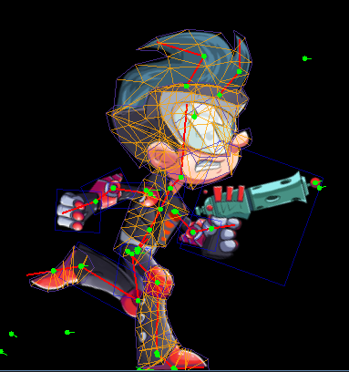
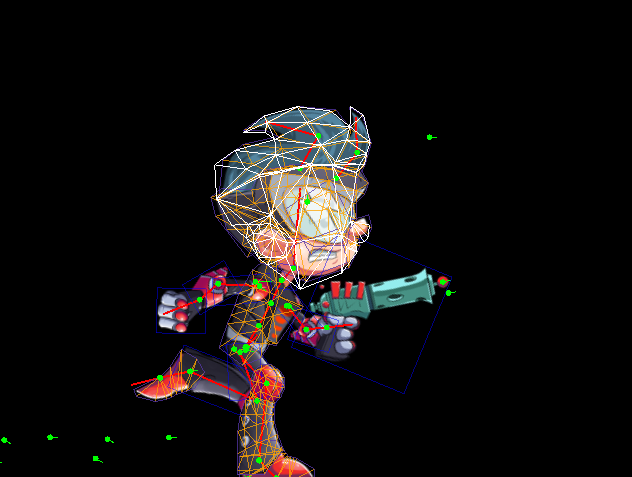

# Mesh Physics for Skeletal Character

## Three meshes

**Rigged mesh**: For a skeletal character, we define a rigged mesh, or so called skin, as $\hat{\mathbf{x}}$. This is the common mesh we see that is controlled by linear blend skinning (LBS).

<figcaption>Fig.1 - Rigged mesh.</figcaption>
 

**Sim mesh**: We cannot apply physics to the rigged mesh, because it's fully controlled by LBS. We define a sim mesh $\mathbf{x}$. It will be updated by physics simulation.

<figcaption>Fig.2 - Sim mesh.</figcaption>
 

**Ref mesh**: Physics simulation needs a reference, and this reference is the setup pose of the character. We assume that the reference mesh represents the static status with no internal force. 