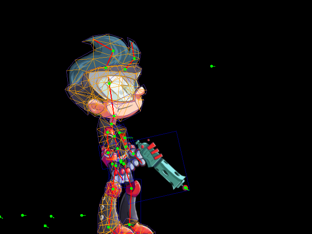

# Mesh Physics for Skeletal Character

## Data Explaining

### Mesh Data

**Rigged mesh**: For a skeletal character, we define a rigged mesh, or so called skin, as $\hat{\mathbf{x}}$. This is the common mesh we see that is controlled by linear blend skinning (LBS).

```
com.esotericsoftware.spine.pbd.LbsData.rigVerts
```


<figcaption>Fig.1 - Rigged mesh.</figcaption>
<br>

**Sim mesh**: We cannot apply physics to the rigged mesh, because it's fully controlled by LBS. We define a sim mesh $\mathbf{x}$. It will be updated by physics simulation.

```
com.esotericsoftware.spine.pbd.DeformMesh.vertices
```


<figcaption>Fig.2 - Sim mesh. (white)</figcaption>
<br>

**Ref mesh**: Physics simulation needs a reference, and this reference is the setup pose of the character. We assume that the reference mesh $\overline{\mathbf{x}}$ represents the static status with no internal force.

```
com.esotericsoftware.spine.pbd.DeformMesh.refVertices
```


<figcaption>Fig.3 - Ref mesh.</figcaption>
<br>

All the positions are **rescaled** by `pbd.MeshData.scale`:
```
scale = max(max_x - min_x, max_y - min_y)
```
This is important 

Other mesh data:
- `pbd.DeformMesh.indices`: Flatten indices of triangles. For example, [0, 1, 2]
- `pbd.DeformMesh.faceMass`: Mass of each triangle
- `pbd.DeformMesh.vertMass`: Mass of each vertex

## Linear Blend Skinning

Each bone $j$ contains an affine transformation $\mathbf{A}_j$ and translation $\mathbf{t}_j$. Similarly, we use $\overline{\mathbf{A}}_j$ and $\overline{\mathbf{t}}_j$ to denote the transformation and translation in setup reference pose.

LBS can be represented as

$$
\mathbf{x}_i=\sum_j w_{ij}(\mathbf{A}_j^*(\overline{\mathbf{x}}_i - \overline{\mathbf{t}}_j) +\mathbf{t}_j)
$$

where $w_{ij}$ is the binding weights, and $\mathbf{A}_j^*=\mathbf{A}_j \overline{\mathbf{A}}_j^{(-1)}$ is a relative affine transformation. In reference pose, we have $\mathbf{A}_j^*=\mathbf{I}$ (identity matrix).

## Position-Based Dynamics

Common simulation methods compute the force and add it to the velocity. They are called explicit method, or forward euler method. They are fast, but problematic for unstable and over-energetic. 

PBD is a method based on implicit time-integration, also named as backward euler method. It is solwer but fast enough for real-time application, visually more appealing and more stable. The creator of this method provides [tutorials](https://matthias-research.github.io/pages/tenMinutePhysics/index.html) for web physics.

### Workflow

Briefly explaining, we start with the positions in current time step $\mathbf{x}^{k}$, and velocity in current time step $\mathbf{v}^{k}$. We want the status of the next time step after time $dt$. The external force $\mathbf{f}_{ext}$ is assumed to be constant on all vertices, such as gravity.

The workflow is very simple:

1. [Generate prediction](https://github.com/yoharol/PBD_Taichi/blob/3b4d3f8f69efcbff7b4b8e516d08417bfde65a55/cons/framework.py#L25C1-L31C80): $\mathbf{p}_i = \mathbf{x}^k_i + \mathbf{v}_i^k dt + \mathbf{f}_{ext}dt^2$ 
2. Constraints projection: Iterate through all constraints $C$, project the constraints to modify $\mathbf{p}_i$
3. [Update velocity](https://github.com/yoharol/PBD_Taichi/blob/3b4d3f8f69efcbff7b4b8e516d08417bfde65a55/cons/framework.py#L33C1-L38C68): Finish this time step, update velocity $\mathbf{v}_i^{k+1} = k_{damp}\frac{\mathbf{p}_i - \mathbf{x}^k_i}{dt}$.
   
$k_{damp}\in [0, 1]$ is a simple damping parameter. $k_{damp}=1$ means no damping.

The [python code](https://github.com/yoharol/PBD_Taichi/blob/3b4d3f8f69efcbff7b4b8e516d08417bfde65a55/test/fish_deform.py#L67C1-L71C22) is

```python
    xpbd.make_prediction()
    xpbd.preupdate_cons()
    for _ in range(sovle_step):
      xpbd.update_cons()
    xpbd.update_vel()
```

### Constraints Projection

All the physics in PBD is represented by a set of scalar functions $C_j$. For example, if two vertices $\mathbf{p}_1$ and $\mathbf{p}_2$ is connected by a mass spring with rest length $l_{12}$, then we have a constraint

$$
C_{12} = ||\mathbf{p}_1-\mathbf{p}_2||-l_{12}.
$$

Suppose there are many springs connecting the vertices, then we have one constraint for each spring $C_{12}, C_{13}, C_{23}, \dots$. Constraint projection is to iterate through all constraints, and modify the positions

$$
\begin{align}
    \Delta \mathbf{x}_{ij} &= m_i^{-1} \nabla_{\mathbf{x}_i} C_j^T(\mathbf{x})\Delta \lambda_j\\
    \Delta \lambda_j &= - \frac{C_j(\mathbf{x})}{\sum_i m_i^{-1} ||\nabla_{\mathbf{x}_i} C_j(\mathbf{x})||^2+\tilde{\alpha}_j}
\end{align}
$$

where $\tilde{\alpha} = \frac{\alpha}{dt^2}$. $\alpha$ is an inverse stiffness parameter. The smaller $\alpha$ is, the more stiff the constraint is. For example, $\alpha=1.0$ means the spring is very stretchable. $\alpha=10^{-3}$ means the spring is stiff. $\alpha=0$ means the spring cannot be stretched at all.

**Normally we set $\alpha$ a small value, but extremely small $\alpha$ will cause the solver to diverge and explode.**

### 